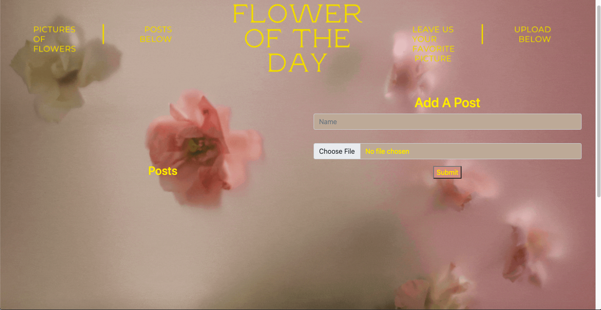

## Personal Express App

-I created a website where you can upload pictures of flowers. Users can like or delete their posts.

[Checkout my portfolio to see live app](https://rodasghidei.netlify.app/)

## How It's Made:

## Tech used:

--HTML, CSS, JavaScript, Express, Node.js, MongoDB

## Lessons Leanred:

--I learned how to use Express and Node.js to get my app running server side and to create use authentication. I also learned how to create a database using MondoDB and with that, I was able to practice using CRUD and rest api's.

##Examples:

--Take a look at these couple examples that I have in my own portfolio:

## Other Projects
[TO-DO-LIST - EXPRESS](https://personalexpressflowers.herokuapp.com/)
## Installation

1. Clone repo
2. run `npm install`

## Usage

1. run `npm run savage`
2. Navigate to `localhost:3000`
